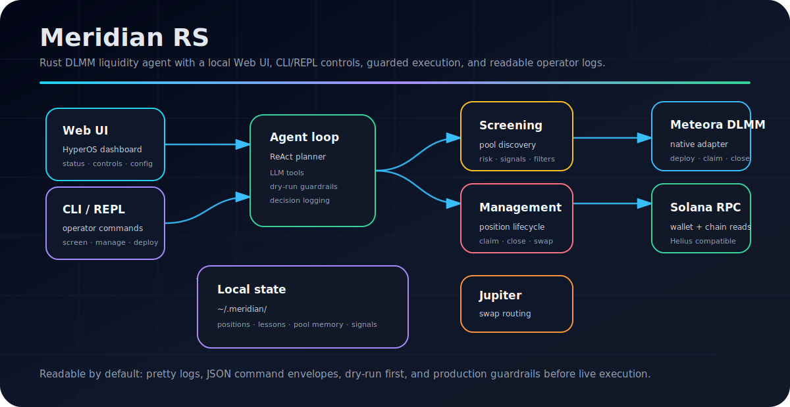
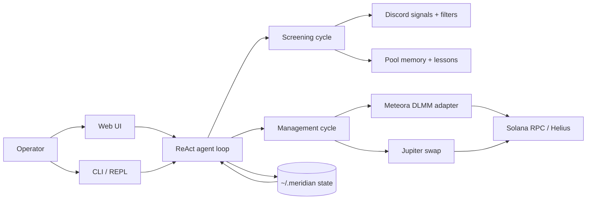

# Meridian RS



<p align="center">
  <a href="https://www.rust-lang.org/"></a>
  <a href="https://solana.com/"></a>
  
  
</p>

**Meridian RS** is a Rust rewrite of the Meridian DLMM liquidity agent for Meteora on Solana. It keeps the useful parts of the original Node.js agent, then moves execution, state, CLI tools, and the local control surface into one typed Rust binary.

The repo is a completed parity port. Roadmap checkboxes are verified claims backed by focused tests, full Rust quality gates, and smoke checks.

## What it does

| Area | Status | Notes |
| --- | --- | --- |
| DLMM execution | Verified | Native Rust deploy, claim, close, and close + swap paths with dry-run guardrails. |
| Operator control | Verified | CLI, interactive REPL, and local Web UI. Telegram is intentionally deferred. |
| Screening | Verified | Discord signals, PVP/rival checks, launchpad filters, indicators, holder/audit enrichment, and reject reasons. |
| Agent memory | Verified | Decision log, lessons, performance history, pool memory cooldowns, and strategy presets. |
| Production ops | Verified | `.env.example`, startup checks, process lock, port checks, and deployment docs. |
| Runtime polish | Verified | REPL `screen`/`manage`, readable logs, refreshed docs, and PnL poller close queues are wired. |

## Operator quickstart

```bash
# 1. Clone and enter the repo
git clone https://github.com/FlipZ3ro/meridian-rs.git
cd meridian-rs

# 2. Create local config and secrets templates
cargo run -- setup --dir .

# 3. Fill wallet, RPC, and LLM keys. Keep DRY_RUN=true while testing.
$EDITOR .env
$EDITOR user-config.json

# 4. Run the local agent + Web UI
cargo run
```

Web UI default: `http://localhost:3000`.

For production-style runs, prefer `~/.meridian/.env`, `MERIDIAN_DATA_DIR`, `MERIDIAN_LOCK_PATH`, and non-public Web UI binding such as `MERIDIAN_WEB_ADDR=127.0.0.1:3000`.

## Command center

Use one-shot commands when you want JSON output and a clean exit. Run without a subcommand to start the long-running runtime.

```bash
# Runtime / setup
cargo run -- help
cargo run -- setup --dir . --force
cargo run -- status
cargo run -- screen --wallet <wallet> --wallet-sol 0
cargo run -- manage --wallet <wallet>

# Read-only views
cargo run -- balance --wallet <wallet>
cargo run -- positions --wallet <wallet>
cargo run -- pnl --pool <pool> --position <position> --wallet <wallet>
cargo run -- candidates --limit 3
cargo run -- study --pool <pool> --limit 4

# Trading actions, all protected by config dry-run unless intentionally live
cargo run -- deploy --pool <pool> --amount <sol> --bins-below 35 --bins-above 0 --strategy spot --dry-run
cargo run -- claim --position <position>
cargo run -- close --position <position> --reason "low yield" --skip-swap
cargo run -- swap --from <mint> --amount <tokens>

# State, lessons, and config
cargo run -- config get screening.timeframe
cargo run -- config set dryRun true
cargo run -- lessons list
cargo run -- performance summary
cargo run -- evolve
cargo run -- pool-memory summary
cargo run -- blacklist list
cargo run -- discord-signals
cargo run -- strategies list
```

Interactive terminal mode supports:

```text
status   show position state summary
screen   run the real one-shot screening cycle and print JSON
manage   run the real one-shot management cycle and print JSON
quit     graceful shutdown
```

## Readable logs

Pretty operator logs are the default. Set `MERIDIAN_LOG_STYLE=pretty` explicitly if you want to pin the style, or `MERIDIAN_LOG_STYLE=plain` if a log shipper needs the older bracketed format.

```text
2026-06-09 10:00:00  ● INFO   main         │ Meridian RS -- DLMM Liquidity Provider Agent v0.2.0
2026-06-09 10:00:01  ● INFO   startup      │ 127.0.0.1:3000 is available
2026-06-09 10:00:02  ▲ WARN   startup      │ missing WALLET_PRIVATE_KEY or MERIDIAN_WALLET_PRIVATE_KEY; live deploy/claim/close/swap cannot sign
2026-06-09 10:00:03  ✖ ERROR  rpc          │ RPC request failed
```

The log shape is intentionally simple: timestamp, level icon, level, module, and message. It is easy to scan in a terminal and still grep-friendly.

## System map



## Project structure

```text
src/
├── main.rs              # runtime, scheduler, REPL, health, Web UI startup
├── cli.rs               # one-shot commands and JSON envelopes
├── cycle.rs             # management, screening, and PnL polling cycles
├── config/              # config loader, env alias mapping, defaults
├── tools/               # DLMM, wallet, screening, executor, integrations
├── agent/               # ReAct loop, roles, prompt context
├── state/               # positions and pool memory
├── web.rs               # HyperOS-style local Web UI
└── utils/               # logger, math, time helpers
```

## Config

Copy `user-config.example.json` to `user-config.json` and `.env.example` to `.env` for local development, or to `~/.meridian/.env` for the default runtime profile.

Minimum useful env values:

```dotenv
DRY_RUN=true
WALLET_PRIVATE_KEY=
MERIDIAN_WALLET=
RPC_URL=https://api.mainnet-beta.solana.com
LLM_BASE_URL=https://openrouter.ai/api/v1
OPENROUTER_API_KEY=
LLM_MODEL=openai/gpt-4o-mini
MERIDIAN_LOG_STYLE=pretty
```

Supported aliases from the original Node.js project include `RPC_URL`, `HELIUS_RPC_URL`, `HELIUS_API_KEY`, `OPENROUTER_API_KEY`, `LLM_API_KEY`, `LLM_MODEL`, `MANAGEMENT_MODEL`, `SCREENING_MODEL`, `GENERAL_MODEL`, `JUPITER_API_KEY`, `PUBLIC_API_KEY`, `LPAGENT_API_KEY`, and the legacy Telegram keys.

Never commit real `user-config.json`, `.env`, wallet private keys, or API keys.

## Runtime state

Mutable runtime files live under `~/.meridian/` by default:

| File | Purpose |
| --- | --- |
| `meridian-state.json` | active positions and recent position events |
| `pool-memory.json` | pool notes, close history, cooldown memory |
| `discord-signals.json` | pending and processed Discord signal queue |
| `lessons.json` | lessons, performance records, and prompt memory |
| `.env` | optional global runtime env file |

Overrides:

```bash
MERIDIAN_DATA_DIR=/path/to/data
MERIDIAN_STATE_PATH=/path/to/meridian-state.json
MERIDIAN_WEB_ADDR=127.0.0.1:3000
HEALTH_PORT=8080
MERIDIAN_LOCK_PATH=/path/to/meridian.lock
```

## Docs

- [`docs/agent-meridian-relay.md`](docs/agent-meridian-relay.md): Agent Meridian / LPAgent relay replacement notes.
- [`docs/discord-signals.md`](docs/discord-signals.md): Discord signal queue and pre-check behavior.
- [`docs/pvp-risk.md`](docs/pvp-risk.md): PVP/rival-pool detection policy.
- [`docs/production-operations.md`](docs/production-operations.md): encrypted env options, launchd/systemd/PM2, startup checks, process lock, and operator replacements.

## JS Meridian parity roadmap

Reference target: [`yunus-0x/meridian`](https://github.com/yunus-0x/meridian)

### Phase 0: baseline Rust skeleton and verification

- [x] Rust project boots with `cargo run`
- [x] Config loader with sane defaults
- [x] LLM client and ReAct-style loop skeleton
- [x] Screening and management cycle modules exist
- [x] Basic Web UI and health/status endpoints exist
- [x] Baseline quality gates pass: `cargo fmt --check`, `cargo clippy --all-targets --all-features -- -D warnings`, `cargo test`

### Phase 1: runtime/config compatibility foundation

- [x] Nested Rust `user-config.json` format loads successfully
- [x] Missing nested `strategy` defaults correctly for older Rust configs
- [x] Original JS flat `user-config.json` format loads successfully
- [x] Original `.env` keys map into Rust runtime consistently
- [x] Dry-run mode is first-class and blocks all transaction submission
- [x] Runtime state files are isolated and documented

### Phase 2: core trading parity

- [x] Wallet private key loading and Solana transaction signing
- [x] Rust base64 transaction signer supports versioned and legacy Solana transactions
- [x] Real Meteora DLMM deploy position flow
- [x] Real claim fees flow
- [x] Real close position flow
- [x] Real close + optional swap-to-SOL flow
- [x] Jupiter swap signing/submission parity
- [x] Agent Meridian relay transaction signing adapter for zap-in/zap-out order responses
- [x] Meteora Rust SDK compatibility spike validates native claim/close/deploy adapter path
- [x] Agent Meridian / LPAgent relay support or documented replacement
- [x] Regression tests for dry-run vs live execution guardrails

### Phase 3: CLI and setup parity

- [x] `meridian` CLI using Rust subcommands
- [x] `setup` wizard generating `.env` and `user-config.json`
- [x] JSON output parity for `balance`, `positions`, `pnl`, `candidates`, `deploy`, `claim`, `close`, `swap`
- [x] One-shot `screen` and `manage` commands
- [x] `config get/set`
- [x] `lessons`, `performance`, `evolve`, `pool-memory`, `blacklist` commands

### Phase 4: agent intelligence parity

- [x] Structured `decision-log.json`
- [x] `get_recent_decisions` tool and prompt injection
- [x] Rich lessons/performance history
- [x] Darwin signal weighting and threshold evolution
- [x] Strategy library with active strategy presets
- [x] Study top LPers / behavior-pattern analysis
- [x] Pool memory cooldown logic matching original behavior

### Phase 5: screening enrichment parity

- [x] Discord signal queue and pre-check pipeline
- [x] PVP/rival-pool risk detection
- [x] Launchpad allow/block filters
- [x] Timeframe-scaled screening thresholds
- [x] Chart indicator presets for entry/exit confirmation
- [x] Token audit, holder, smart-wallet, narrative enrichment parity
- [x] Detailed reject reasons for filtered candidates

### Phase 6: control surface parity

- [x] Web UI replaces Telegram control surface for local usage
- [x] Live positions, balances, candidates, cycle logs, and decisions in Web UI
- [x] Manual screen/manage/deploy/claim/close controls in Web UI
- [x] Config editor in Web UI
- [x] Lessons/performance/blacklist views in Web UI
- [x] Optional Telegram notifications/commands intentionally deferred; Web UI is the supported replacement control surface

### Phase 7: production operations parity

- [x] `.env.example` parity with original project
- [x] Encrypted env flow or documented alternative
- [x] launchd/systemd/PM2-equivalent deployment guide
- [x] Startup checks for repo/cwd/config/wallet/API keys
- [x] Duplicate process and port conflict guards
- [x] Claude Code slash-command compatibility or Rust-native replacement
- [x] HiveMind/shared lessons support or documented replacement

### Phase 8: runtime operator polish

- [x] Interactive REPL `screen`/`manage` commands execute the real one-shot cycles and print JSON output
- [x] README visual refresh and readable command/log output
- [x] PnL poller exit signals dispatch or queue close actions through the guarded close flow

## License

MIT
